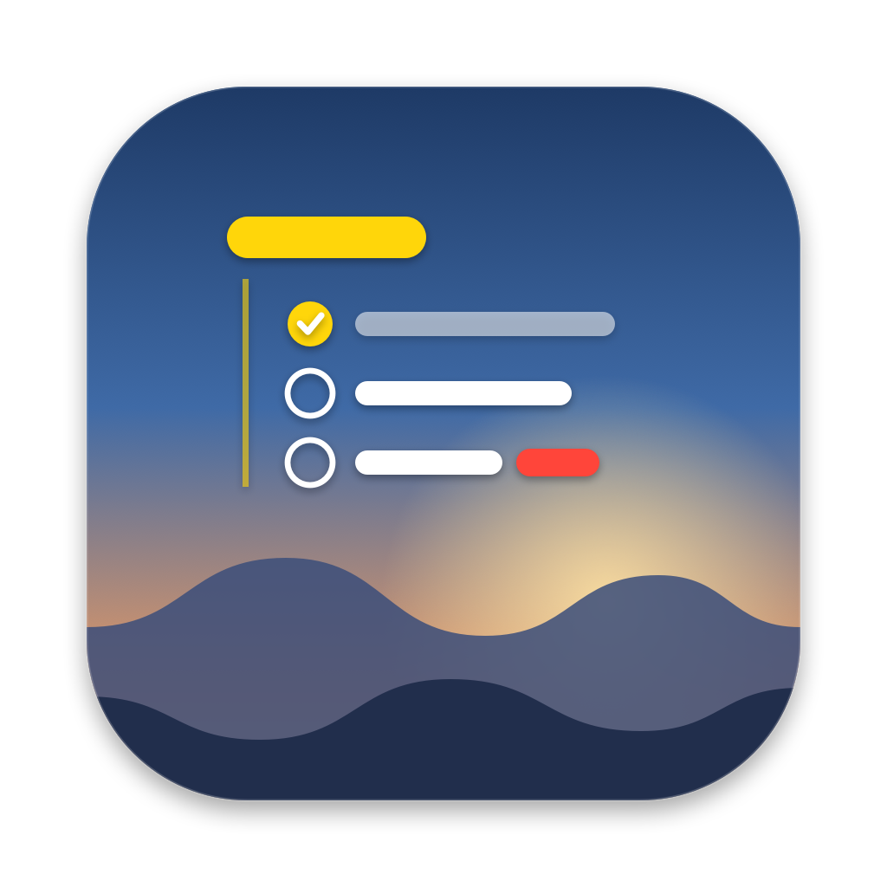
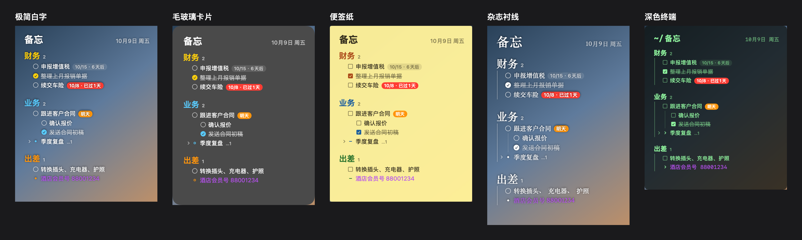

<p align="center"></p>

<h1 align="center">桌面备忘 DeskMemo</h1>

<p align="center">把备忘直接「长」在 Mac 桌面上：壁纸之上、所有窗口之下，抬眼就能看到，点一下就能改。</p>



## 为什么做这个

备忘工具很多，问题是**总忘了去打开**。桌面备忘把待办做成桌面的一部分：不用打开任何 App，看到桌面就看到要做的事。

## 功能

- **贴在桌面上**：像壁纸的一部分，不挡任何窗口；开机自动出现
- **树形结构**：分类 → 事项 → 子事项，可以折叠，可以拖动排序
- **直接编辑**：点哪改哪；回车新建、Tab 缩进，跟大纲笔记一样
- **到期提醒**：写 `@10-15` 就显示「6天后」，快到期变橙、过期变红
- **同步「提醒事项」**：iPhone 上用 Siri 加的提醒自动出现在桌面；在桌面上勾选、修改也会同步回手机。和桌面分类同名的列表会自动并进去
- **样式随便改**：5 套预设（极简白字 / 毛玻璃卡片 / 便签纸 / 杂志衬线 / 深色终端），字体、颜色、符号、连接线、背景都能细调
- **位置随便放**：左上、居中、右上，或者按住标题拖到任意位置
- **数据是普通文件**：保存成 Markdown，默认放在 iCloud 云盘「桌面备忘」文件夹，手机「文件」App 里能看，任何编辑器都能改；每天自动备份

## 下载安装

1. 到 [Releases](../../releases) 下载最新的 `DeskMemo-x.x.x.dmg`
2. 打开 dmg，把「桌面备忘」拖到「应用程序」
3. 从「应用程序」里打开它

> **第一次打开提示「无法验证开发者」？**
> 这个工具没有做苹果付费认证，所以系统会拦一下。点「完成」，然后打开
> **系统设置 → 隐私与安全性**，往下找到「已阻止使用"桌面备忘"」，点 **仍要打开**，输入开机密码即可。只需要一次。

打开后会询问是否允许访问「提醒事项」，点允许即可（不允许也能用，只是不显示提醒事项）。

**系统要求**：macOS 14（Sonoma）及以上，Apple 芯片和 Intel 芯片都支持。

## 使用

| 操作 | 方法 |
|---|---|
| 编辑 | 点任意一条 |
| 新建一条 / 子项 | 回车 / Tab（⇧Tab 提升一级） |
| 勾选完成 | 点圆圈，或编辑时按 ⌘↩ |
| 排序 | 按住拖动；或右键 → 移到最前 / 上移 / 下移 |
| 换样式 | 右键标题「桌面备忘」 |
| 移动位置 | 按住标题拖动 |
| 被窗口挡住时 | 按 **⌃⌥M** 叫到最前面，再按一次或 Esc 放回去 |
| 撤销 | 不在编辑时按 ⌘Z |
| 设置 | 菜单栏图标 → 设置；或者再打开一次 App |

## 数据放在哪里

| 内容 | 位置 |
|---|---|
| 备忘内容 | iCloud 云盘 `桌面备忘/备忘.md`（没开 iCloud 云盘时在「文稿」里） |
| 样式和位置设置 | `~/Library/Application Support/DeskMemo/settings.json` |
| 每日备份（保留 30 天） | `~/Library/Application Support/DeskMemo/backups/` |

备忘文件格式：

```markdown
- 工作
  - [ ] 周五前交周报 @10-17
  - [x] 已经做完的
  - 普通文字
```

## 卸载

1. 菜单栏图标 → 退出
2. 把「应用程序」里的「桌面备忘」拖到废纸篓
3. （可选）删除 `~/Library/Application Support/DeskMemo` 和 iCloud 云盘里的「桌面备忘」文件夹

## 从源码构建

只需要 Xcode 命令行工具（`xcode-select --install`），不需要完整的 Xcode。

```bash
./build.sh          # 编译并安装到 ~/Applications，自己用
./release.sh        # 打包通用版 dmg / zip 到 dist/，发给别人
```

源码结构：

| 文件 | 内容 |
|---|---|
| `Sources/App.swift` | 窗口层级、菜单栏、全局快捷键、开机自启 |
| `Sources/Views.swift` | 树形渲染、拖动排序、布局调整 |
| `Sources/OutlineField.swift` | 行内编辑（回车 / Tab / 退格 / 上下键） |
| `Sources/MemoStore.swift` | 树操作、文件同步、撤销 |
| `Sources/RemindersStore.swift` | 和「提醒事项」双向同步 |
| `Sources/Model.swift` | Markdown 读写、日期解析 |
| `Sources/Settings.swift` | 样式字段、预设、设置存储 |
| `Sources/SettingsView.swift` | 设置窗口 |
| `scripts/make_icon.swift` | 生成 App 图标 |

## 许可

[MIT](LICENSE)
